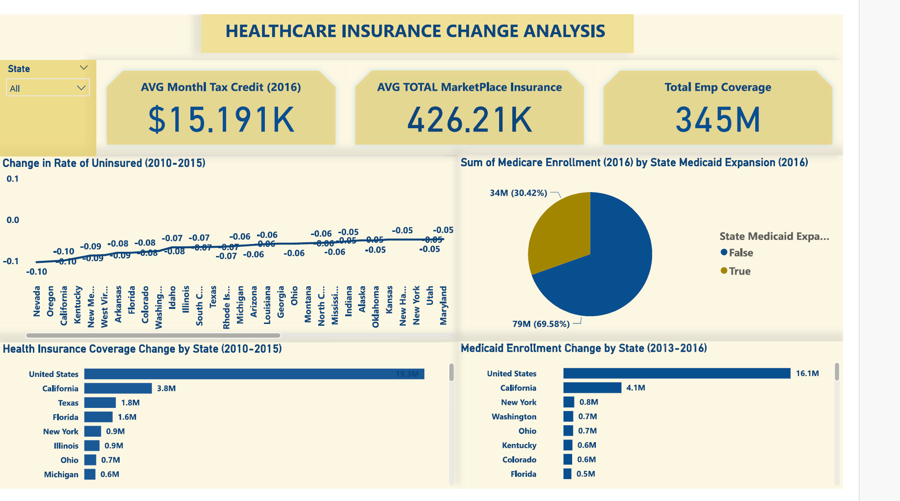

# 🏥 Healthcare Insurance Change Analysis Dashboard

## 🧾 Overview

This **Healthcare Insurance Change Analysis Dashboard** visualizes key healthcare coverage and Medicaid enrollment trends across the United States from 2010 to 2016. It enables policymakers, analysts, and healthcare professionals to monitor the effects of Medicaid expansion and policy reforms under the Affordable Care Act (ACA).

---

## 📊 Key Metrics

### 💰 Average Monthly Tax Credit (2016)

* **\$15.191K** average tax credit per enrollee under the ACA.

### 🏥 Avg Total Marketplace Insurance

* **426.21K** average number of individuals enrolled in marketplace insurance plans.

### 👥 Total Employer Coverage

* **345M** individuals with employment-based coverage.

---

## 🔍 Detailed Insights

### 📉 Change in Rate of Uninsured (2010–2015)

* States like **Nevada**, **Oregon**, and **California** saw the largest drop in uninsured rates (up to -0.10).
* Reflects major ACA-driven expansion.

### 🧾 Sum of Medicare Enrollment by State Medicaid Expansion (2016)

* **69.58%** of enrollees were in states that did **not expand** Medicaid.
* **30.42%** in expansion states.

### 🌍 Health Insurance Coverage Change by State (2010–2015)

* **United States** overall: +19.3M insured individuals.
* Top states:

  * **California**: +3.8M
  * **Texas**: +1.8M
  * **Florida**: +1.6M

### 📈 Medicaid Enrollment Change (2013–2016)

* **United States**: +16.1M
* Highest increases:

  * **California**: +4.1M
  * **New York**: +0.8M
  * **Washington/Ohio**: +0.7M each

---

## 💼 Use Cases

* **Policy Impact Evaluation**: Measure Medicaid expansion effectiveness.
* **State-by-State Comparison**: Track regional disparities in healthcare reform adoption.
* **Healthcare Planning**: Support decisions in healthcare provisioning, especially in under-covered states.

---

## 🛠️ Built With 

* **Power BI** for interactive visuals
* **US Census Bureau**, **CMS**, and other open data sources

---

